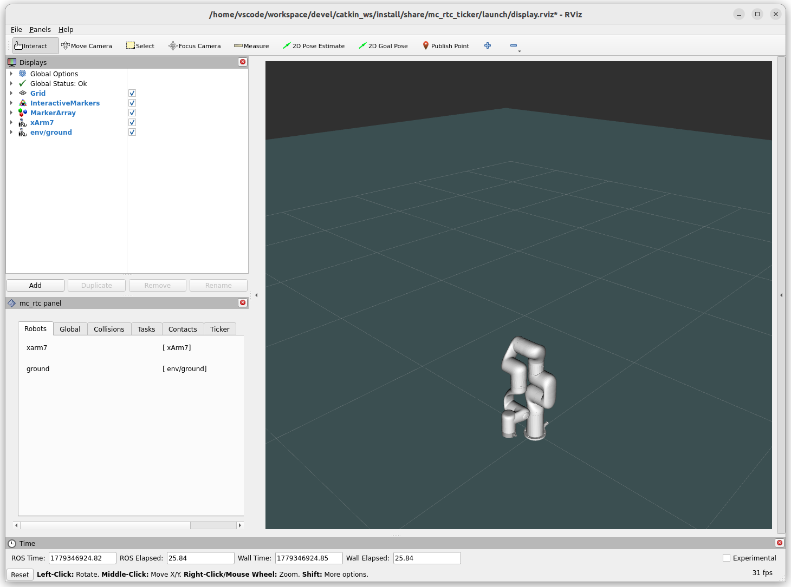

# mc_xarm

mc_rtc robot modules for [UFACTORY xArm](https://www.ufactory.cc/) series robots: xArm5, xArm6, xArm7, xArm7Mirror, Lite6.
All manipulators are alse available to run with mc_mujoco.

## Dependencies

- [ROS2](https://docs.ros.org/)

- [mc_rtc](https://jrl-umi3218.github.io/mc_rtc/)

- [mc_mujoco](https://github.com/rohanpsingh/mc_mujoco) (if using mujoco)

- [xarm_description](https://github.com/xArm-Developer/xarm_ros2/tree/humble/xarm_description)

```sh
git clone https://github.com/xArm-Developer/xarm_ros2.git
cd xarm_ros2
colcon build --packages-select xarm_description
source install/setup.bash # change setup.sh or setup.zsh accordingly
cd ..
```

## Build & Install

```sh
git clone https://github.com/isri-aist/mc_xarm.git
cd mc_xarm
mkdir -p build && cd build
cmake ..
make
sudo make install
cd ..
```

To test the module is installed correctly

```sh
mc_rtc_ticker -f etc/mc_rtc.yaml
```
<p align="center">
  
</p>

## mc_mujoco

If you would like to use the robots with mc_mujoco, use cmake with options `MUJOCO_DESCRIPTION_XARM7` or `MUJOCO_DESCRIPTION_LITE6` on.

```sh
cmake .. -DMUJOCO_DESCRIPTION_XARM7=ON
# or
cmake .. -DMUJOCO_DESCRIPTION_LITE6=ON
```

To test with mc_mujoco
```sh
mc_mujoco -f etc/mc_rtc.yaml
```
